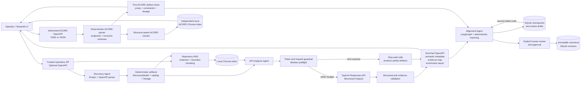
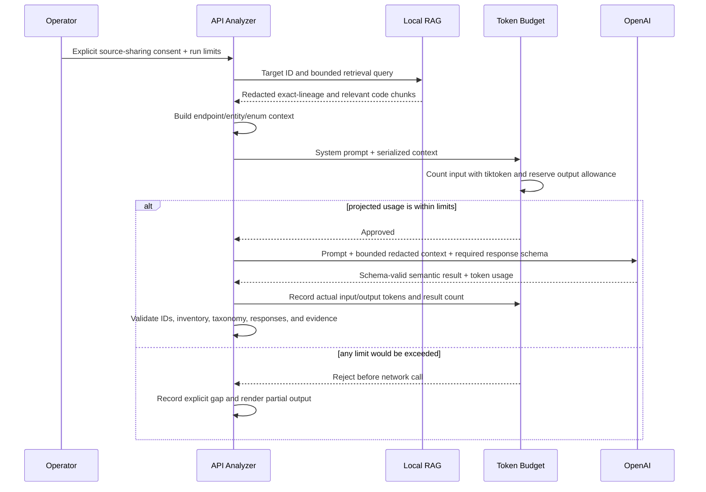

# High-Level Architecture and LLM Data Flow

Last updated: 2026-09-29

## Architecture

Discovery remains authoritative for routes, methods, parameters, request/response contracts,
fields, types, validations, IDs, and lineage. The LLM may describe and classify those discovered
elements, but it cannot add, remove, or rename structural elements.

ACORD ingestion is independent from the regional application flow. Its parser, artifacts, saved
history, chunks, and Chroma index are separate from repository Discovery/RAG. It uses deterministic
OpenAPI parsing plus local embeddings and makes no LLM call. The Alignment Agent consumes the
regional catalog plus an accepted ACORD ingestion, optionally compares an immutable canonical
baseline first, and uses ACORD as fallback. Its LangGraph execution and review drafts are durable
in local SQLite; every proposed decision still requires explicit human approval.

## Data flow into the LLM

### Sent to OpenAI

- A versioned system prompt containing classification rules and the controlled taxonomy.
- One bounded target at a time: an endpoint, an entity with all its attributes, or an enum.
- Deterministic Discovery facts for that target, including structural IDs and source lineage.
- Selected, relevant repository snippets returned by the saved RAG index.
- Snippets after likely-secret redaction and character-limit truncation.
- A Pydantic response schema so the result must match the expected structure.
- All provider input is serialized into system/user text strings. No images, image URLs, or binary
  content are sent to the semantic model.

### Not sent to OpenAI by the API Analyzer

- The entire repository archive as one payload.
- The local Chroma database or embedding vectors.
- The OpenAI API key.
- Local application-history files.
- Images, generated diagrams, image URLs, and binary artifact content.
- Files excluded by repository boundaries, size limits, or secret/build/vendor path rules.

The optional OpenAI embedding mode is a separate action. When selected, all included redacted
chunks are sent for embedding only after its own explicit consent. The default Sentence Transformer
embedding path remains local.

The Alignment Agent itself makes no LLM call for matching. A reviewer may separately request one
schema-validated OpenAI draft for a true unmatched item. That call receives only the selected
regional item, its baseline/ACORD candidates, and reviewer instructions; its result cannot enter a
canonical version until explicitly selected, reasoned, and approved.

## Credit and token guardrails

The API Analyzer enforces these controls before and after each paid semantic request:

1. `tiktoken` counts the exact system prompt and JSON context before transmission.
2. Each request has an operator-configurable maximum estimated input size (default 24,000 tokens).
3. Each response has an operator-configurable API `max_output_tokens` ceiling (default 4,000 tokens).
4. The run has a configurable total-token ceiling (default 120,000 tokens).
5. The run has a configurable paid-request ceiling (default 100 requests).
6. The next request reserves its full output allowance; if projected usage crosses the run limit,
   it is rejected before contacting OpenAI.
7. A budget rejection stops the current analysis loop and preserves completed results as partial
   artifacts instead of repeatedly attempting calls.
8. Every call records its operation, estimated input, actual provider-reported input, actual output,
   total tokens, output ceiling, completion status, and whether it produced a structured result.
   The per-call ledger and run totals are written to `enrichment-report.json`; the normal Streamlit
   result view does not display the internal usage ledger.
9. Existing provider preflight, bounded SDK retries, structured-output validation, and explicit
   partial-result reporting remain active.

In addition, every OpenAI Responses API, canonical-gap, and embedding invocation writes a separate
secret-safe JSON record under `.llm-logs/YYYY-MM-DD/` (or `LLM_CALL_LOG_DIRECTORY`). Completed logs
contain provider-reported input/output/total token counts; failed-call logs retain null token counts
when the provider did not return usage. These files contain no prompts, source text, model output,
API key, or raw provider error message.

These are token ceilings, not currency estimates. Actual cost depends on the selected model's
current pricing; using token limits avoids embedding volatile price tables in the application.
